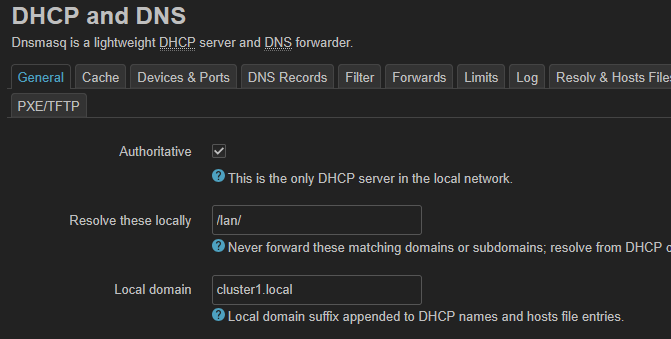
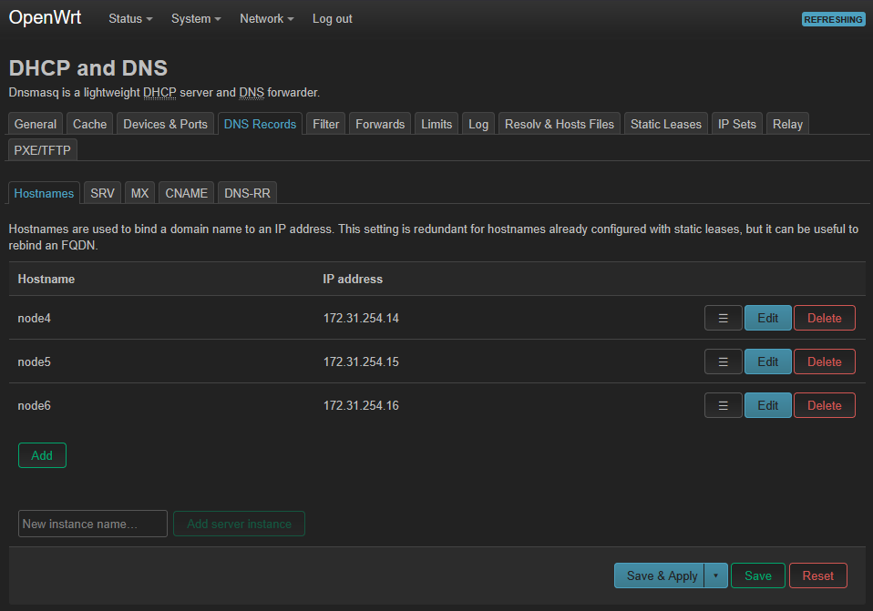
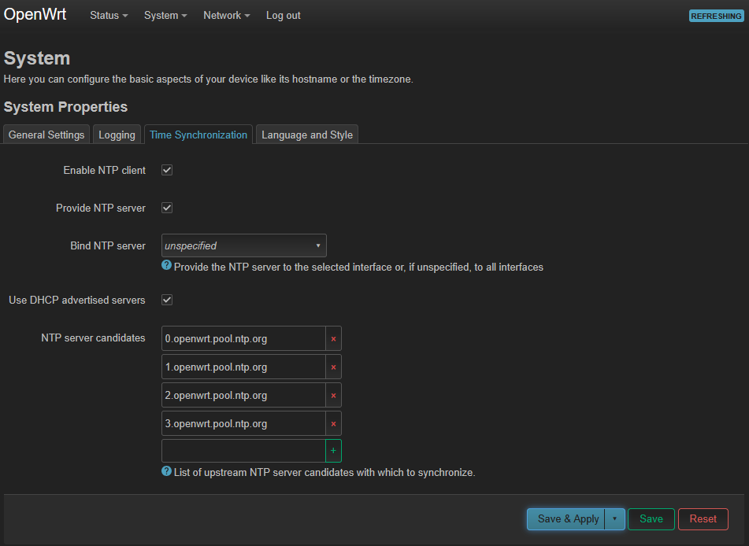

# Incus Cluster on Slackware

This is my journey of setting up an Incus cluster on Slackware-current.  Incus will provide a cloud-like service for running containers and virtual machines.  The cluster will have shared storage and virtual networking.  A virtual router will provide connectivity between the cluster, a LAN, and a WAN.  A managed ethernet switch can break out these networks into physical connections.
This is not my first time on this journey.  I have had many stops, starts, and tangents along the way.  I had to apply some working knowledge, learn some new technologies, and even get a refresher on a few skills I hadn't used in a while.  This is a compilation of what I learned, and the process I used to get a working cluster. 
I have used Slackware (among other distros) for a long time.  Since I want to build many of the components from source to make sure I have the latest version, I figured Slackware would make an excellent base since it should let me compile most packages without too much deviation from their default configuration.
This whole journey will be an exercise using many popular open-source tools and popular technologies.  Some things may be overly complex or completely unneeded, but that's fine since the idea is to be able to use several tools in a single cluster.

## The Hardware

I plan to build the cluster from four nodes.  Three nodes will make up the cluster, and one node will be the build/deploy node.  The three cluster nodes should be identical so running virtual machines can be live-migrated from node to node.  My nodes are using 6th generation Intel Core i5 CPUs with 16GB of RAM.  This is probably the very minimum configuration I would recommend.  The build/deploy node can be different.  It can also be a virtual machine.  Since this machine will compile the software, more RAM and CPU cores will be advantageous.
The storage and networking are simple for this proof-of-concept / lab-grade cluster but could be based on much faster hardware.  I will be using the built-in gigabit ethernet as the cluster and storage network.  This network can be strictly internal to the cluster and is used to intra-cluster communication and storage.  For the OVN uplink network, I will be using a USB connected gigabit ethernet adapter on each node.  This network may be slower and less reliable due to the USB connection; I think it will have less impact on the uplink network than the storage network.

## The Software

The software stack will consist of Slackware Linux as the base OS.  Incus will be installed on top of that, along with Qemu for KVM virtual machines.  For the networking layer, Open Virtual Networking (OVN) will be used; OVN, in turn, uses Open vSwitch.  For storage, I will use OpenZFS on top of LINSTOR and DRBD.  These packages will provide a shared networking and storage layer across the cluster.

## The Process

First, I will set up the build/deploy node since that will be used to bootstrap everything else.  Once the build/deploy node is set up, I can download the Slackbuilds scripts I have created previously and use those to compile all the (additional) software needed for the cluster.
I will install many of the packages on the build/deploy host after I build them.  That will leave me with a functional Incus system on the build/deploy host.  I will configure the build/deploy node as a standalone Incus host. 
I will create an OpenWrt VM in Incus on the build/deploy host.  This will serve as the cluster router VM.  All traffic into and out of the cluster will pass through this VM (eventually).  The VM will start its life on the build/deploy host and will be moved to the cluster once it has been created.

## Building the Cluster

First, I’ll start with the build/deploy node.  I’ll install Slackware64-current with software sets A, AP, D, K, L, N, TCL, and X.  This won't make a system with a very useable GUI but should give all the support libraries needed to build the additional software on.  For this system, I’ll include some swap space and make the root partition take the entire drive (except for the UEFI partition of course).  For networking, I’ll connect `eth0` to my LAN and configure the system for DHCP.  I’ll take care of the rest of the network configuration later.  Once Slackware is installed, I’ll login as root for the first time and configure the system.

### Configure the user

Logged in as root, I need to add a user account.  After I have a user account, I'll be able to access the build/deploy node via SSH.  I'll use `useradd` to add a user called `clusteradm` that will be used for Ansible and general cluster administration.  I’ll also add this user to `wheel` group which I later use to grant sudo access. 

```text
root@deploy:~# useradd -d /home/clusteradm -g users -m -s /bin/bash clusteradm
root@deploy:~# usermod -a -G wheel clusteradm
root@deploy:~# passwd clusteradm
New password:
Retype new password:
passwd: password updated successfully
```

I need this user to have sudo access.  I do this by allowing the `wheel` group to have sudo access.  I'll run the `visudo` command to edit `/etc/sudoers`.  Around line 125, there is a template for allowing members of group wheel to execute any command.  I’ll uncomment that line to allow sudo access for the wheel group.

```text
## Uncomment to allow members of group wheel to execute any command
%wheel ALL=(ALL:ALL) ALL
```

I can now log in as the `clusteradm` user for this rest of this document (unless otherwise noted).  I'll use this user for general cluster administration, and I'll also use it later for Ansible.

### Configure Networking

The build/deploy node has two network interfaces.  The internal ethernet interface (eth0) is connected to my local LAN and has DHCP enabled.  The second ethernet interface (eth1) is a USB ethernet adapter and will connect to cluster network.  The cluster nodes will be connected to the cluster network with their eth0 interface.

> [!TIP]
> Check `/etc/udev/rules.d/70-persistent-net.rules` on Slackware
> to see which physical interface is associated with each interface name.

> [!NOTE]
> The network connections on the build/deploy node
> and the compute nodes are “opposite.”  That is,
> eth1 of the build/deploy node is connected to
> the same switch as eth0 of the cluster nodes.

I'll also want to create a bridge for each interface in case I want to attach VMs to them later.  In Slackware, this is done by editing `/etc/rc.d/rc.inet1.conf`.

```
...
# These options are set for interface [0] and [1].
# All other options are cleared.
IFNAME[0]="lan-br"
BRNICS[0]="eth0"
USE_DHCP[0]="yes"
IFNAME[1]="cluster-br"
BRNICS[1]="eth1"
IPADDRS[1]="172.31.254.10/24"
...
```

In addition, I'll need to set up the internal hostname for the cluster interface.  I'll add the following line to `/etc/hosts` and then restart the system to apply the changes.

```text
172.31.254.10           build.cluster1.local
```

> [!WARNING]
> These changes won't take effect until the system
> is restarted.  There are ways around this, but
> I'll take the few seconds to reboot now.

### Build the software

Now, I need to clone my repository of SlackBuilds.  This will give me scripts to build all the software needed for the Incus cluster.

```text
clusteradm@deploy:~$ git clone https://github.com/scottr131/slackbuilds --depth=1
Cloning into 'slackbuilds'...
remote: Enumerating objects: 124, done.
remote: Counting objects: 100% (124/124), done.
remote: Compressing objects: 100% (115/115), done.
remote: Total 124 (delta 36), reused 90 (delta 9), pack-reused 0 (from 0)
Receiving objects: 100% (124/124), 29.35 KiB | 4.89 MiB/s, done.
Resolving deltas: 100% (36/36), done.
```

An individual package can be built by changing into its directory and running the appropriate Slackbuild command.  SlackBuilds are meant to be run as root, hence the use of sudo.

```bash
OUTPUT=~/slackbuilds/packages/ PKGTYPE=txz BLDTHREADS=8 sudo ./usbredir.Slackbuild
wget --directory-prefix=usbredir $DOWNLOAD_x86_64
```

### Configure SSH

Ansible depends on SSH so I should get that configured first.  I'll start with the just the build/deploy node itself.  These commands are run as the `clusteradm` user.  With the first command I’ll create an ed25519 keypair.  The second command will add the public key into the authorized_keys file allowing `clusteradm` to SSH into the build/deploy node.

```text
clusteradm@build:~$ ssh-keygen -t ed25519
clusteradm@build:~$ ssh-copy-id build
/usr/bin/ssh-copy-id: INFO: Source of key(s) to be installed: "/home/clusteradm/.ssh/id_ed25519.pub"
The authenticity of host 'deploy (::1)' can't be established.
ED25519 key fingerprint is SHA256:Fqgm/8OZa/....
This key is not known by any other names.
Are you sure you want to continue connecting (yes/no/[fingerprint])? yes
/usr/bin/ssh-copy-id: INFO: attempting to log in with the new key(s), to filter out any that are already installed
/usr/bin/ssh-copy-id: INFO: 1 key(s) remain to be installed -- if you are prompted now it is to install the new keys
(clusteradm@build) Password:

Number of key(s) added: 1
```

### Prepare Ansible

I’ll need to install Ansible on the build/deploy node. I don’t currently have a Slackbuild script for this, so I’ll install it from `pip`.  I'll ignore the warnings about running `pip` as root because I'm doing this intentionally to install Ansible as a system package.

```bash
sudo pip install ansible --root-user-action ignore
```

Next I need to grab my Ansible playbooks from GitHub.

```bash
cd ~
git clone https://github.com/scottr131/ansible --depth=1
```

Then I'll move all the packages I built into the ansible/slackware/files directory.  This is where my Ansible playbooks look for them.

```bash
mv ~/slackbuilds/*.txz ~/ansible/slackware/files/
```

I keep my rc and default configuration files in a separate repository than the Ansible playbooks.  I’ll clone that repository and then run this script to copy the rc and default configuration files to where my playbook expects them.  This assumes I cloned everything into the home directory of the clusteradm user.

```bash
cd ~
git clone https://github.com/scottr131/linux.git --depth=1
cd ansible
#
# The following script copies the rc and defaults
# files to where the playbooks expect them
#
  for PBOOK in incus linstor ovn qemu local-config; do
    mkdir -p $PBOOK/files/default  
    mkdir -p $PBOOK/files/rc.d
  done

  cp ~/linux/slackware/etc/default/incus incus/files/default
  cp ~/linux/slackware/etc/rc.d/rc.incusd incus/files/rc.d

  cp ~/linux/slackware/etc/default/linstor-controller ~/linux/slackware/etc/default/linstor-satellite ~/linux/slackware/etc/default/zfs linstor/files/default
  cp ~/linux/slackware/etc/rc.d/rc.drbd ~/linux/slackware/etc/rc.d/rc.linstor-controller ~/linux/slackware/etc/rc.d/rc.linstor-satellite ~/linux/slackware/etc/rc.d/rc.zfs linstor/files/rc.d

  cp ~/linux/slackware/etc/default/openvswitch ~/linux/slackware/etc/default/ovn-central ~/linux/slackware/etc/default/ovn-host ovn/files/default
  cp ~/linux/slackware/etc/rc.d/rc.openvswitch ~/linux/slackware/etc/rc.d/rc.ovn-central ~/linux/slackware/etc/rc.d/rc.ovn-host ovn/files/rc.d

  cp ~/linux/slackware/etc/rc.d/rc.local ~/linux/slackware/etc/rc.d/rc.local_shutdown local-config/files/rc.d
```

Now is a good time to perform a couple basic checks on Ansible to make sure it can connect and become root.

```bash
# This should return clusteradm
ansible -i hosts.ini -a "whoami" nodes
# This should return root
# -b = become, -K = with sudo password
ansible -i hosts.ini -a "whoami" nodes -b -K
```

## Deploy Standalone Incus

Now I need to install Incus to the build/deploy node.  I'll do this so that I can have a standalone node I can use to transfer images and instances in to and out of the cluster.  Since I'll use Ansible to deploy the three main nodes, I might as well use it for deployment here too.

I'll create a temporary `hosts.ini` with just the build/deploy node in it.  My Ansible playbooks are configured to deploy to a group called `nodes`. 

```ini
[nodes]
build.cluster1.local
```

Now I can run Ansible playbooks against the build/deploy node.  I'll start by deploying QEMU and Incus in order to be able to run VM instances.

```bash
ansible-playbook -i hosts.ini -b -K qemu/qemu-on-slackware.yaml
ansible-playbook -i hosts.ini -b -K incus/incus-groups.yml
ansible-playbook -i hosts.ini -b -K incus/incus-on-slackware.yaml
```

> [!WARNING]
> The incus-on-slackware playbook changes the cgroups
> version.  This will take effect when the system is
> restarted.  Restart the system now!

## Start a Minimal Incus System

Incus is installed on the build/deploy node, but it's not yet configured or started.  Incus won't automatically start on the build/deploy node because the custom rc.local script isn't installed yet.  I'll fix this later.  For now, I'll start Incus manually and check its basic functionality.

```bash
# Enable and start Incus
sudo chmod +x /etc/rc.d/rc.incusd
sudo /etc/rc.d/rc.incusd start
```

I'll check that I see an Incus process running and check the log output.

```text
clusteradm@build:~$ ps -e | grep incusd
 1220 ?        00:00:00 incusd
clusteradm@build:~$ sudo tail /var/log/incusd

time="2025-09-04T23:48:13-04:00" level=warning msg="AppArmor support has been disabled because of lack of kernel support"
time="2025-09-04T23:48:13-04:00" level=warning msg=" - AppArmor support has been disabled, Disabled because of lack of kernel support"
time="2025-09-04T23:48:13-04:00" level=warning msg=" - Couldn't find the CGroup hugetlb controller, hugepage limits will be ignored"
time="2025-09-04T23:48:13-04:00" level=warning msg=" - Couldn't find the CGroup memory swap accounting, swap limits will be ignored"
```

Since that looks good (only warnings), I'll create a minimal configuration and check to make sure it is working as expected.

```bash
# Create a minimal Incus configuration
sudo incus admin init --minimal
```

## Configure Incus Access and Verify Functionality

Right now, only root has Incus access.  Since I will be using the clusteradm account for general cluster administration, I want that account to have access to Incus.  I'll add the clusteradm account to the incus group - this will allow it to access the socket.  In addition, I'll add the account to the incus-admin group to give it full access to Incus. 

```bash
sudo usermod -a -G incus-admin clusteradm
sudo usermod -a -G incus clusteradm
```

Now I'll do a couple checks to make sure Incus sees the networking and storage as expected.

```text
clusteradm@build:~$ incus list
+------+-------+------+------+------+-----------+
| NAME | STATE | IPV4 | IPV6 | TYPE | SNAPSHOTS |
+------+-------+------+------+------+-----------+
clusteradm@build:~$ incus storage list
+---------+--------+-------------+---------+---------+
|  NAME   | DRIVER | DESCRIPTION | USED BY |  STATE  |
+---------+--------+-------------+---------+---------+
| default | dir    |             | 1       | CREATED |
+---------+--------+-------------+---------+---------+
clusteradm@build:~$ incus network list
+------------+----------+---------+-----------------+---------------------------+-------------+---------+---------+
|    NAME    |   TYPE   | MANAGED |      IPV4       |           IPV6            | DESCRIPTION | USED BY |  STATE  |
+------------+----------+---------+-----------------+---------------------------+-------------+---------+---------+
| cluster-br | bridge   | NO      |                 |                           |             | 0       |         |
+------------+----------+---------+-----------------+---------------------------+-------------+---------+---------+
| eth0       | physical | NO      |                 |                           |             | 0       |         |
+------------+----------+---------+-----------------+---------------------------+-------------+---------+---------+
| eth1       | physical | NO      |                 |                           |             | 0       |         |
+------------+----------+---------+-----------------+---------------------------+-------------+---------+---------+
| incusbr0   | bridge   | YES     | 10.203.150.1/24 | fd42:14a2:c537:7d84::1/64 |             | 1       | CREATED |
+------------+----------+---------+-----------------+---------------------------+-------------+---------+---------+
| lan-br     | bridge   | NO      |                 |                           |             | 0       |         |
+------------+----------+---------+-----------------+---------------------------+-------------+---------+---------+
| lo         | loopback | NO      |                 |                           |             | 0       |         |
+------------+----------+---------+-----------------+---------------------------+-------------+---------+---------+
clusteradm@build:~$
```

Incus appears to be working correctly.  Any errors here indicate a problem with permissions or the Incus daemon itself.  If I didn't see all the networks I expected, I would check the OS level networking configuration in /etc/rc.d/rc.inet1.conf first.  In this case, these are the results I expected to see.

## Deploy Cluster Router

In the final configuration, I want to have a virtual OpenWrt router that will route all traffic in to and out of the cluster.  I'll go ahead and start setting that up now so that the cluster nodes can reach the Internet through it.

I want to use an OpenWrt VM for this router.  I want to use a VM instead of a container so that it can be live migrated between cluster nodes later.  Since the available images are only container images, I'll need to build my own VM.

```bash
# Create a new profile from the default
incus profile copy default rtr-vm
# Set the profile to have 2 CPU cores a 1GB RAM
incus profile set rtr-vm limits.cpu=2 limits.memory=1GiB
# Set a 1GB root device
incus profile device set rtr-vm root size=1GiB
# Create a new VM based on that profile
# and connected to both network bridges
incus create rtr-vm --empty --vm -n cluster-br -p rtr-vm
```

The build/deploy node doesn't have a display attached, so now is a good time to connect a laptop with the Incus client to control Incus on the build/deploy node and later the cluster.  This isn't strictly needed but makes things much easier.  First, I'll need to enable the Incus API server on port 8443 and then generate a token for my laptop.

```text
~$ incus config set core.https_address=":8443"
~$ incus config trust add laptop
Client laptop certificate add token:
eyJjbGllbnRfbmFtZSI6ImxhcHRvcCIsImZpbmdlcnByaW50IjoiMDhjNjcyYzc5NWI5MTYzMmQ4NjgzZDc4ZjZmNzY1OWZyMTZmZDY5OWEDNkNWM3OWVjNWY2YTVkYjZlZGQwYmVjOSIsImFkZHJlc3NlcyI6WyIxMC4xLjMxLjIyMDo4NDQzI3OWVjNWY2dr5sdfFfC4xMDo4NDQzIiwiMTAuMTAuMTY5LjE6ODQ0MyIsIltmZDQyOjI0OTc6YjEwNTo1YTc0OjoxXTo4NDQyMTZmZDY5OWECI6IjcyMTZmZDY5OWE1ODI0MTMxMTA3ODk1OGVjZjgyNDNkZGMyNTljYzg3MzU0MjZjZTlhYzU4NWIxOGI3ODUzMDIiLCJleHBpcmVzX2F0IjoiMDAwMS0wMS0wMVQwMDowMDowMFoifQ==
```

I'll copy that token over to my laptop and run this command (on the laptop) to add the build/deploy node as an Incus remote.  I'll also switch the default remote on the Incus client since I'll be working with the build/deploy node.

```text
user@laptop:~$ incus remote add deploy-incus deploy --token eyJjbGllbnRfbmFtZSI6ImxhcHRvcCIsImZpbmdlcnByaW50IjoiMDhjNjcyYzc5NWI5MTYzMmQ4NjgzZDc4ZjZmNzY1OWZyMTZmZDY5OWEDNkNWM3OWVjNWY2YTVkYjZlZGQwYmVjOSIsImFkZHJlc3NlcyI6WyIxMC4xLjMxLjIyMDo4NDQzI3OWVjNWY2dr5sdfFfC4xMDo4NDQzIiwiMTAuMTAuMTY5LjE6ODQ0MyIsIltmZDQyOjI0OTc6YjEwNTo1YTc0OjoxXTo4NDQyMTZmZDY5OWECI6IjcyMTZmZDY5OWE1ODI0MTMxMTA3ODk1OGVjZjgyNDNkZGMyNTljYzg3MzU0MjZjZTlhYzU4NWIxOGI3ODUzMDIiLCJleHBpcmVzX2F0IjoiMDAwMS0wMS0wMVQwMDowMDowMFoifQ==
Certificate fingerprint: 08c672c795b91632d8683d78f5b916329fa045b916329ec5f6a5db6ed5b91632ec9
ok (y/n/[fingerprint])? y
Client certificate now trusted by server: deploy-incus
user@laptop:~$ incus remote switch deploy-incus
```

Now, on my laptop, I'll upload the Slackware USB installer image that I used earlier to set up the nodes.  I plan to use that to install OpenWrt into the instance I just created.  It's not technically an ISO, but it will boot like one.  I also need to attach that storage volume to the router instance and set it to the highest boot priority.  Then, I'll start the VM with a VGA console.  I show my Linux based laptop in these examples, but the same commands also work on Windows or macOS.

```text
user@laptop:~$ incus storage volume import default usbboot.img slack-install --type=iso
user@laptop:~$ incus storage volume attach default slack-install rtr-vm
user@laptop:~$ incus config device set rtr-vm slack-install boot.priority=10
user@laptop:~$ incus network attach lan-br rtr-vm eth1
user@laptop:~$ incus start rtr-vm --console=vga
```

Once the Slackware installer starts up, I'll get to a root shell, get an IP address via DHCP from my LAN, set a root password (for this temporary installer session) and finally start the Dropbear SSH server so I can SSH into the installer to run these commands instead of typing them into the VGA console.

```bash
dhcpcd eth1
passwd
/etc/rc.d/rc.dropbear start
```

> [!NOTE]
> Requesting an IP from eth1 is intentional.  The VM
> has two network interfaces.  `eth0` is connected
> to the cluster network, and I have temporarily connected
> the `eth1` interface to the lan-br bridge (connecting
> it to my LAN).

Now I can SSH into the router VM (as `root`).  It will get its address via DHCP, I can view that with `ip a`.  Sometimes it takes a few seconds to obtain the IP.  I'll download the OpenWrt image to the /tmp folder, expand it, and write it out the root device.  Then I'll go ahead and expand the root partition.

```bash
cd /tmp
wget https://downloads.openwrt.org/releases/24.10.2/targets/x86/64/openwrt-24.10.2-x86-64-generic-ext4-combined-efi.img.gz
gunzip openwrt-24.10.2-x86-64-generic-ext4-combined-efi.img.gz
dd if=openwrt-24.10.2-x86-64-generic-ext4-combined-efi.img of=/dev/sda status=progress
```

I can use fdisk to resize the partition.  Then I'll use resize2fs to expand the filesystem on that expanded partition.  At that point, I can shut the VM down to get it ready for first boot.

```text
root@darkstar:~# fdisk /dev/sda

Welcome to fdisk (util-linux 2.41.1).
Changes will remain in memory only, until you decide to write them.
Be careful before using the write command.

GPT PMBR size mismatch (246303 != 2097151) will be corrected by write.
The backup GPT table is corrupt, but the primary appears OK, so that will be used.
The backup GPT table is not on the end of the device. This problem will be corrected by write.

Command (m for help): p

Disk /dev/sda: 1 GiB, 1073741824 bytes, 2097152 sectors
Disk model: QEMU HARDDISK
Units: sectors of 1 * 512 = 512 bytes
Sector size (logical/physical): 512 bytes / 512 bytes
I/O size (minimum/optimal): 512 bytes / 512 bytes
Disklabel type: gpt
Disk identifier: CD0D3008-AE71-21D7-5617-D7010323E800

Device      Start    End Sectors  Size Type
/dev/sda1     512  33279   32768   16M Linux filesystem
/dev/sda2   33280 246271  212992  104M Linux filesystem
/dev/sda128    34    511     478  239K BIOS boot

Partition table entries are not in disk order.

Command (m for help): e
Partition number (1,2,128, default 128): 2

New <size>{K,M,G,T,P} in bytes or <size>S in sectors (default 1007.7M):

Partition 2 has been resized.

Command (m for help): w
The partition table has been altered.
Calling ioctl() to re-read partition table.
Syncing disks.

root@darkstar:~# resize2fs /dev/sda2
resize2fs 1.47.3 (8-Jul-2025)
Resizing the filesystem on /dev/sda2 to 257979 (4k) blocks.
The filesystem on /dev/sda2 is now 257979 (4k) blocks long.

root@darkstar:~# poweroff
```

Now I'll remove the Slackware installer USB and start the VM.  It should boot from the root storage device.

```text
incus config device remove rtr-vm slack-install
incus start rtr-vm --console=vga
```

While I can configure everything from the config files, I'll allow HTTPS access to the OpenWrt web UI (LUCI).  This way I can configure the router via the web interface.  I can remove this access later by disabling this firewall rule.   In rtr-vm (the OpenWrt VM), I'll add this entry to /etc/config/firewall to open a port for the web interface. I will also set a root password with the `passwd` command since OpenWrt defaults to no password.  This password will also be used with the web interface.

```text
config rule
        option name          Allow-HTTPS
        option src           wan
        option proto         tcp
        option dest_port     443
        option target        ACCEPT
        option family        ipv4
```

I will also go ahead and configure the cluster network interface at this time too.  I could do this later from the web interface, but I think it makes sense to get it done now.  I'll edit `/etc/config/network` and update the `lan` interface definition with the correct IP address for the cluster LAN - 172.31.254.1.  By default, OpenWrt will run a DHCP server on this interface, and assign IPs .100 through .250 to DHCP clients.  This will be fine for now.

Then I can run the `reload-config` command on rtr-vm to reload the configuration (and apply this new firewall rule).  At that point, I can use `ip a` to examine the network interfaces.  `eth1` has an IP address from my LAN, `eth0` exists, and `br-lan` has a static IP.   At this point, I have `eth0` of each node cluster connected to a switch along with `eth1` of the build/deploy node.  This switch has no connections to any other networks.  I can ping each cluster node from rtr-vm, and the cluster nodes have connectivity to the outside world through rtr-vm.  In this way rtr-vm can enforce firewall rules for traffic coming in to and out of the cluster network.  Due to the firewall rule I just added, the OpenWrt web interface is now available on my LAN (which is the WAN interface from OpenWrt's point of view).  If I forgot to set a password earlier, the web interface will remind me and I'll set a password now.

## Build the Cluster Nodes

Now I need to set up the three cluster nodes.  These three nodes will have their internal network interface (eth0) connected to the same switch as eth1 on the build/deploy node.  The router VM is up and running on this network, so these nodes can access the Internet through that router if needed for Slackware installation.  DHCP is available for use during installation.  
I’ll install Slackware64-current similar to how I did on the build/deploy node.  I’ll only install software sets A, AP, L, N, TCL, and X.  I’m not sure I’ll need X, but a minimal GUI on these systems may be useful later.  For these nodes, I won’t create a swap partition.  I think I would rather VMs and containers be killed due to out of memory than excessive swapping.  I’ll also make a small UEFI partition and a 32GB root partition.  I’ll configure eth0 on each node for the appropriate IP (as listed below) with the router VM as the gateway.

| Hostname | Domain         | IP Address (eth0) |
|:-------- |:-------------- |:----------------- |
| rtr-vm   | cluster1.local | 172.31.254.1/24   |
| deploy   | cluster1.local | 172.31.254.10/24  |
| node4    | cluster1.local | 172.31.254.14/24  |
| node5    | cluster1.local | 172.31.254.15/24  |
| node6    | cluster1.local | 172.31.254.16/24  |

| Service     | Value        |
|:----------- |:------------ |
| Gateway     | 172.31.254.1 |
| Primary DNS | 172.31.254.1 |

## Set up Hostname Resolution

I'll set up hostname resolution in two ways.  OpenWrt has an integrated dnsmasq DNS server available on `rtr-vm`.  However, that DNS server won’t be available until `rtr-vm` has started. I will configure the nodes in `/etc/hosts` so the names resolve early in cluster startup and even if something is pretty broken.  I’ll create a hosts file (on the build/deploy node at `/etc/hosts`) to reflect the cluster network I am building.  I'll start with this file just on the build/deploy node, but I can later use Ansible to update the cluster nodes as well.

```text
127.0.0.1               localhost
::1                     localhost
172.31.254.10           build.cluster1.local build
172.31.254.14           node4.cluster1.local node4
172.31.254.15           node5.cluster1.local node5
172.31.254.16           node6.cluster1.local node6
```

In addition to the hosts file, I’ll go ahead and configure the DNS server on `rtr-vm`.  This can be done either at the `rtr-vm` console or via the OpenWrt web interface.  At the console, I can edit `/etc/config/dhcp`.  I’ll need to modify the `option domain` line for dnsmasq as well as adding a domain name entry for each node.

```text
config dnsmasq
        ...
        option domain 'cluster1.local'
        ...
config domain
        option name 'node4'
        option ip '172.31.254.14'

config domain
        option name 'node5'
        option ip '172.31.254.15'

config domain
        option name 'node6'
        option ip '172.31.254.16'
```

In the web interface, I can go to **Network > DHCP and DNS**.  On the **General** tab, I need to change the “Local domain” field to `cluster1.local`.



Then I need to go over to the **DNS Records** tab.  There, I can click **Add** and create an entry for each node.  I’ll make sure to click **Save & Apply** after adding the entries to make sure they get saved.



## Configure NTP

> [!CAUTION]
> Time synchronization is very important in a cluster.
> DO NOT SKIP THIS SECTION!  Your cluster will break
> in weird ways.

I plan to allow `rtr-vm` to sync from `pool.ntp.org` and then the cluster nodes will sync to `rtr-vm`.  This certainly won’t provide the most accurate time but should be sufficient for this cluster.  To do this from the console, I just need to edit `/etc/config/system` and add a line to enable the server.  By default, OpenWrt is already configured to get its time from pool.ntp.org. 

```text
config timeserver 'ntp'
        option enable_server '1'
        list server '0.openwrt.pool.ntp.org'
        list server '1.openwrt.pool.ntp.org'
        list server '2.openwrt.pool.ntp.org'
        list server '3.openwrt.pool.ntp.org’
```

I can also do this from the OpenWrt web interface.  I can go to **System > System** and then select the **Time Synchronization** tab.  All I need to do is check the “Provide NTP server” box and click “Save & Apply”.



Now I need to configure each node to use `rtr-vm` as its time source.  This is something I could probably do through Ansible in the future, but for now, I’ll just do this manually to make sure time synchronization is working early in the process.  I’ll edit `/etc/ntp.conf` on **each** node and add an entry for the NTP server on `rtr-vm`.

```text
...
server 172.31.254.1 iburst
...
```

In addition, I will enable the NTP daemon, manually synchronize the time, and enable the NTP daemon **on each node**.

```bash
# Enable ntpd
sudo chmod +x /etc/rc.d/rc.ntpd
# Stop ntpd in case it was already running
sudo /etc/rc.d/rc.ntpd stop
# Sync time with rtr-vm
sudo ntpdate 172.31.254.1
# Start ntpd
sudo /etc/rc.d/rc.ntpd start
```

> [!WARNING]
> The ntpd configuration steps should be done ON ALL NODES!
> This includes the build/deploy node and the three cluster nodes.

## Set up SSH Keys on Cluster Nodes

Now I'm back on the build/deploy node.  I need to copy the clusteradm@build public key to each cluster node.  I'll start with node3.

```
clusteradm@build:~$ ssh-copy-id node4.cluster1.local
/usr/bin/ssh-copy-id: INFO: Source of key(s) to be installed: "/home/clusteradm/.ssh/id_ed25519.pub"
The authenticity of host 'node4.cluster1.local (172.31.254.14)' can't be established.
ED25519 key fingerprint is SHA256:xKEzNwXwgGGWiUdAKRrEtnp9XzvHsv9N0b8l8ifPSv0.
This key is not known by any other names.
Are you sure you want to continue connecting (yes/no/[fingerprint])? yes
/usr/bin/ssh-copy-id: INFO: attempting to log in with the new key(s), to filter out any that are already installed
/usr/bin/ssh-copy-id: INFO: 1 key(s) remain to be installed -- if you are prompted now it is to install the new keys
(clusteradm@node4.cluster1.local) Password:

Number of key(s) added: 1

Now try logging into the machine, with: "ssh 'node4.cluster1.local'"
and check to make sure that only the key(s) you wanted were added.
```

Then, I need to repeat that for the other cluster nodes.

```
ssh-copy-id node5.cluster1.local
ssh-copy-id node6.cluster1.local
```

Finally, I need to make sure that the `clusteradm` account has sudo access on each node.  Just as earlier on the build/deploy node, I'll login as a root user and run the `visudo` command to edit `/etc/sudoers`.  Around line 125, there is a template for allowing members of group wheel to execute any command.  I’ll uncomment that line to allow sudo access for the wheel group.

```text
## Uncomment to allow members of group wheel to execute any command
%wheel ALL=(ALL:ALL) ALL
```

## Deploy with Ansible

At this point, it should be time to use Ansible to deploy all the required packages to all three cluster nodes.  First, I'll make an updated version of my `hosts.ini`.  I'll add `ansible_python_interpreter` to each host to specify the specific Python interpreter.  This prevents a warning message from showing up on every Ansible run.  I'm also going to define a variable that contains an IP address for both the cluster and the OVN network interfaces of each host.  This will be used in the networking templates later.  Finally, I'll define a variable containing the default gateway for all nodes.

```
[nodes]
node4 ansible_python_interpreter=/usr/bin/python3 cluster_ip=172.31.254.14/24 ovn_ip=172.29.2.14/24 ansible_host=node4.cluster1.local
node5 ansible_python_interpreter=/usr/bin/python3 cluster_ip=172.31.254.15/24 ovn_ip=172.29.2.15/24 ansible_host=node5.cluster1.local
node6 ansible_python_interpreter=/usr/bin/python3 cluster_ip=172.31.254.16/24 ovn_ip=172.29.2.16/24 ansible_host=node6.cluster1.local

[nodes:vars]
cluster_gateway=172.31.254.1

[build]
build.cluster1.local
```

I'll do a final check on Ansible access to the cluster nodes.  First, I'll run an ad-hoc `whoami` command on each node, followed by running the same command as root.  I'll be prompted to provide the sudo password, which is the same for all nodes.

```text
clusteradm@build:~/ansible$ ansible -i hosts.ini -a "whoami" nodes
node5 | CHANGED | rc=0 >>
clusteradm
node4 | CHANGED | rc=0 >>
clusteradm
node6 | CHANGED | rc=0 >>
clusteradm
clusteradm@build:~/ansible$ ansible -i hosts.ini -a "whoami" nodes -b -K
BECOME password:
node5 | CHANGED | rc=0 >>
root
node6 | CHANGED | rc=0 >>
root
node4 | CHANGED | rc=0 >>
root
```

That looks good.  The clusteradm user can access each node and become root.  With that, I can deploy Qemu and Incus to the nodes by running the appropriate playbooks.

```bash
ansible-playbook -i hosts.ini -K qemu/qemu-on-slackware.yaml
ansible-playbook -i hosts.ini -K incus/incus-groups.yml
ansible-playbook -i hosts.ini -K incus/incus-on-slackware.yaml
ansible-playbook -i hosts.ini -K linstor/linstor-on-slackware.yaml
ansible-playbook -i hosts.ini -b -K ovn/ovn-on-slackware.yaml
```

## Local Cluster Configuration Files

Now I need to install some configuration files that are customized for this cluster configuration.  This playbook mainly installs an rc.local file to start the services installed earlier if their rc file is marked as executable.

```bash
ansible-playbook -i hosts.ini -b -K local-config/local-config.yaml
```

## Host Level Network Configuration

Now we need to configure the network interfaces at the host level for each cluster node.  Each cluster node has two interfaces.  eth0 is the embedded physical interface and will be used for Incus and LINSTOR traffic.  This is connected to an internal bridge called cluster-br.  eth1 is a USB-attached network interface and will be used for OVN traffic.  This network will handle encapsulated traffic, so it should support jumbo frames otherwise the MTU will be reduced on the encapsulated link.  The USB network adapters and switch I'm using support jumbo frames, so I'll have to make sure that it is enabled later.  This configuration will be sufficient for now.   I'll apply an Ansible playbook that applies the desired network configuration to `/etc/rc.d/rc.inet1.conf` on each cluster node using templates.  The IP address for each hosts' cluster and ovn interfaces are defined in the inventory file.

> [!NOTE]
> I have included my template file in the repository.  If you
> try to recreate this, you may want to edit the template at
> `ansible/local-config/files/rc.d/rc.inet1.conf.j2`.

```bash
ansible-playbook -i hosts.ini -b -K local-config/cluster-net.yaml
```

## Reboot the Cluster Nodes

At this point, I have made changes to the cgroup configuration, the networking configuration, and the system PATH.  I'll reboot the nodes so these changes can take effect.

```bash
ansible -i hosts.ini -a "reboot" nodes -b -K
```

## Verify Networking

Before proceeding, I'll use an ad-hoc command with Ansible to verify that the bridges came up with the correct interfaces assigned.  Make a note of the bridge id - if the MAC address is all zeroes, then the eth1 adapter is not being recognized.

```text
clusteradm@build:~/ansible$ ansible -i hosts.ini -a "brctl show" nodes -b -K
BECOME password:
node5 | CHANGED | rc=0 >>
bridge name     bridge id               STP enabled     interfaces
client-br               8000.a0cec817c91e       no              eth1.10
cluster-br              8000.6c4b90a8d384       no              eth0
mgmt-br         8000.a0cec817c91e       no              eth1.20
ovn-br          8000.a0cec817c91e       no              eth1.15
uplink-br               8000.a0cec817c91e       no              eth1
node4 | CHANGED | rc=0 >>
bridge name     bridge id               STP enabled     interfaces
client-br               8000.a0cec817cb68       no              eth1.10
cluster-br              8000.6c4b90a8cfef       no              eth0
mgmt-br         8000.a0cec817cb68       no              eth1.20
ovn-br          8000.a0cec817cb68       no              eth1.15
uplink-br               8000.a0cec817cb68       no              eth1
node6 | CHANGED | rc=0 >>
bridge name     bridge id               STP enabled     interfaces
client-br               8000.a0cec817c6ec       no              eth1.10
cluster-br              8000.6c4b90a8165f       no              eth0
mgmt-br         8000.a0cec817c6ec       no              eth1.20
ovn-br          8000.a0cec817c6ec       no              eth1.15
uplink-br               8000.a0cec817c6ec       no              eth1
```

## Enable and Start Storage and Networking

Since I don't have this procedure fully refined, I'll use Ansible ad-hoc commands here.  It should probably become a playbook of its own.  My playbooks install all the services disabled.  I'll need to enable and start both DRBD and ZFS for use with LINSTOR.  I don't need to "start" these as there are currenly no DRBD devices or DRBD pools.

```bash
# Enable the services
ansible -i hosts.ini -a "chmod +x /etc/rc.d/rc.drbd" nodes -b -K
ansible -i hosts.ini -a "chmod +x /etc/rc.d/rc.zfs" nodes -b -K
```

Now I'll get the LINSTOR system running.  

```bash
# Enable the LINSTOR satellite service
ansible -i hosts.ini -a "chmod +x /etc/rc.d/rc.linstor-satellite /etc/rc.d/rc.drbd /etc/rc.d/rc.zfs" nodes -b -K
# Make sure log directory exists, corrects a bug in my Slackbuild
ansible -i hosts.ini -a "mkdir -p /var/log/linstor" nodes -b -K
# Start the LINSTOR satellite on all cluster nodes
ansible -i hosts.ini -a "/etc/rc.d/rc.linstor-satellite start" nodes -b -K
```

I'll check the log files to make sure this worked before proceeding.

```bash
ansible -i hosts.ini -a "tail /var/log/linstor/satellite" nodes
```

I'll create the config folders for OVS and OVN.  These should probably be created with the Slackbuild package.  This section can probably be removed with the package works right.

```bash
ansible -i hosts.ini -a "mkdir -p /etc/openvswitch" nodes -b -K
ansible -i hosts.ini -a "mkdir -p /etc/ovn" nodes -b -K
```

I want to be sure I have a blank database created for OVS and OVN.  This may not be strictly necessary, but it certainly won't cause any problems to do at this point.

```bash
# Create OVS database
ansible -i hosts.ini -a "ovsdb-tool create /etc/openvswitch/conf.db /usr/share/openvswitch/vswitch.ovsschema" nodes -b -K
# Create OVN north bound database
ansible -i hosts.ini -a "ovsdb-tool create /etc/ovn/ovnnb_db.db /usr/share/ovn/ovn-nb.ovsschema" nodes -b -K
# Create OVN south bound database
ansible -i hosts.ini -a "ovsdb-tool create /etc/ovn/ovnsb_db.db /usr/share/ovn/ovn-sb.ovsschema" nodes -b -K
```

Now I'll enable and start the services one by one and run the init command.  I'm not sure this is strictly necessary here, but I'm following the procedure outlined in the OVS and OVN installation from source instructions.

```bash
ansible -i hosts.ini -a "chmod +x /etc/rc.d/rc.openvswitch /etc/rc.d/rc.ovn-central" nodes -b -K

ansible -i hosts.ini -a "/etc/rc.d/rc.openvswitch start" nodes -b -K
ansible -i hosts.ini -a "ovs-vsctl --no-wait init" nodes -b -K

ansible -i hosts.ini -a "/etc/rc.d/rc.ovn-central start-nbdb" nodes -b -K
ansible -i hosts.ini -a "ovn-nbctl --no-wait init" nodes -b -K

ansible -i hosts.ini -a "/etc/rc.d/rc.ovn-central start-sbdb" nodes -b -K
ansible -i hosts.ini -a "ovn-sbctl init" nodes -b -K
```

## Start LINSTOR Cluster

Now, I'll get the LINSTOR cluster running across the three cluster nodes.  One node will be the initial controller.  I'll choose node4 and enable and bring up the container service there.  I'll run these commands **on node4** as the `clusteradm` user.

```
sudo chmod +x /etc/rc.d/rc.linstor-controller
sudo /etc/rc.d/rc.linstor-controller start
```

Now I can make sure the controller service is working by getting a node list.  Since I haven't added any nodes, this will be empty, but it won't show any errors.

```
sudo linstor node list
```

Next, I'll add the three cluster nodes to the LINSTOR cluster.  I'll add the first node as combined since it runs the controller.  After running each command, LINSTOR shows a success message and indicates all the storage providers available.

```
sudo linstor node create node4.cluster1.local 172.31.254.14 --node-type combined
sudo linstor node create node5.cluster1.local 172.31.254.15 --node-type satellite
sudo linstor node create node6.cluster1.local 172.31.254.16 --node-type satellite
```

After the nodes are added, I'll query LINSTOR to make sure everything is online.

```text
clusteradm@node1:~$ sudo linstor node list
╭────────────────────────────────────────────────────────────────────────╮
┊ Node                 ┊ NodeType  ┊ Addresses                  ┊ State  ┊
╞════════════════════════════════════════════════════════════════════════╡
┊ node4.cluster1.local ┊ COMBINED  ┊ 172.31.254.14:3366 (PLAIN) ┊ Online ┊
┊ node5.cluster1.local ┊ SATELLITE ┊ 172.31.254.15:3366 (PLAIN) ┊ Online ┊
┊ node6.cluster1.local ┊ SATELLITE ┊ 172.31.254.16:3366 (PLAIN) ┊ Online ┊
╰────────────────────────────────────────────────────────────────────────╯
```

Now I need to create a storage pool.  Since the term "storage pool" is used by ZFS, LINSTOR, and Incus, I'll name the pools accordingly to keep track of them.  These commands create a LINSTOR storage pool across all nodes called `linstor-pool` that is backed by a local ZFS pool on each node called `zfs-pool`.  LINSTOR will create the ZFS pool during the LINSTOR pool creation.  The ZFS pool will be created on the extra physical partition created when each node was set up (`/dev/nvme0n1p3` in this case).  I'll specify a type of `zfs-thin` to indicate I want to use a ZFS pool with thin allocation.

```
sudo linstor physical-storage create-device-pool --pool-name zfs-pool --storage-pool linstor-pool zfsthin node4.cluster1.local /dev/nvme0n1p3
sudo linstor physical-storage create-device-pool --pool-name zfs-pool --storage-pool linstor-pool zfsthin node5.cluster1.local /dev/nvme0n1p3
sudo linstor physical-storage create-device-pool --pool-name zfs-pool --storage-pool linstor-pool zfsthin node6.cluster1.local /dev/nvme0n1p3
```

## Start OVN Cluster

To configure the OVN cluster, I'll create three configuration files - one for each cluster node.  These are stored with the Ansible files under `local-config/hosts`. I'll point the nodes at node4 for the database for now.  I'll use IPs on the ovn-br to keep the intra-cluster traffic on that network.  This is also the network that will need jumbo frames for the encapsulation overhead.

ansible/local-config/hosts/node1/ovn-central

```text
OVN_CTL_OPTS="--ovn-nb-logfile=/var/log/ovn/ovsdb-server-nb.log \
    --db-nb-pidfile=/var/run/ovn/ovnnb_db.pid \
    --db-nb-sock=/var/run/ovn/ovnnb_db.sock \
    --db-nb-ctrl-sock=/var/run/ovn/ovnnb_db.ctl \
    --ovn-sb-logfile=/var/log/ovn/ovsdb-server-sb.log \
    --db-sb-pidfile=/var/run/ovn/ovnsb_db.pid \
    --db-sb-sock=/var/run/ovn/ovnsb_db.sock \
    --db-sb-ctrl-sock=/var/run/ovn/ovnsb_db.ctl \
    --db-nb-addr=172.29.2.11 \
    --db-nb-create-insecure-remote=yes \
    --db-sb-addr=172.29.2.11 \
    --db-sb-create-insecure-remote=yes \
    --db-nb-cluster-local-addr=172.29.2.11 \
    --db-sb-cluster-local-addr=172.29.2.11 \
    --ovn-northd-nb-db=tcp:172.29.2.11:6641,tcp:172.29.2.12:6641,tcp:172.29.2.13:6641 \
    --ovn-northd-sb-db=tcp:172.29.2.11:6642,tcp:172.29.2.12:6642,tcp:172.29.2.13:6642"
```

ansible/local-config/hosts/node2/ovn-central

```text
OVN_CTL_OPTS="--ovn-nb-logfile=/var/log/ovn/ovsdb-server-nb.log \
    --db-nb-pidfile=/var/run/ovn/ovnnb_db.pid \
    --db-nb-sock=/var/run/ovn/ovnnb_db.sock \
    --db-nb-ctrl-sock=/var/run/ovn/ovnnb_db.ctl \
    --ovn-sb-logfile=/var/log/ovn/ovsdb-server-sb.log \
    --db-sb-pidfile=/var/run/ovn/ovnsb_db.pid \
    --db-sb-sock=/var/run/ovn/ovnsb_db.sock \
    --db-sb-ctrl-sock=/var/run/ovn/ovnsb_db.ctl \
    --db-nb-addr=172.29.2.12 \
    --db-nb-cluster-remote-addr=172.29.2.11
    --db-nb-create-insecure-remote=yes \
    --db-sb-addr=172.29.2.12 \
    --db-sb-cluster-remote-addr=172.29.2.11 \
    --db-sb-create-insecure-remote=yes \
    --db-nb-cluster-local-addr=172.29.2.12 \
    --db-sb-cluster-local-addr=172.29.2.12 \
    --ovn-northd-nb-db=tcp:172.29.2.11:6641,tcp:172.29.2.12:6641,tcp:172.29.2.13:6641 \
    --ovn-northd-sb-db=tcp:172.29.2.11:6642,tcp:172.29.2.12:6642,tcp:172.29.2.13:6642"
```

ansible/local-config/hosts/node3/ovn-central

```text
OVN_CTL_OPTS="--ovn-nb-logfile=/var/log/ovn/ovsdb-server-nb.log \
    --db-nb-pidfile=/var/run/ovn/ovnnb_db.pid \
    --db-nb-sock=/var/run/ovn/ovnnb_db.sock \
    --db-nb-ctrl-sock=/var/run/ovn/ovnnb_db.ctl \
    --ovn-sb-logfile=/var/log/ovn/ovsdb-server-sb.log \
    --db-sb-pidfile=/var/run/ovn/ovnsb_db.pid \
    --db-sb-sock=/var/run/ovn/ovnsb_db.sock \
    --db-sb-ctrl-sock=/var/run/ovn/ovnsb_db.ctl \
    --db-nb-addr=172.29.2.13 \
    --db-nb-cluster-remote-addr=172.29.2.11
    --db-nb-create-insecure-remote=yes \
    --db-sb-addr=172.29.2.13 \
    --db-sb-cluster-remote-addr=172.29.2.11 \
    --db-sb-create-insecure-remote=yes \
    --db-nb-cluster-local-addr=172.29.2.13 \
    --db-sb-cluster-local-addr=172.29.2.13 \
    --ovn-northd-nb-db=tcp:172.29.2.11:6641,tcp:172.29.2.12:6641,tcp:172.29.2.13:6641 \
    --ovn-northd-sb-db=tcp:172.29.2.11:6642,tcp:172.29.2.12:6642,tcp:172.29.2.13:6642"
```

Now I'll enable the OVN central and host services on ALL the nodes.  Then I'll make sure OVN central is stopped before making changes.

```
ansible -i hosts.ini -a "chmod +x /etc/rc.d/rc.ovn-central" nodes -b -K
ansible -i hosts.ini -a "chmod +x /etc/rc.d/rc.ovn-host" nodes -b -K
ansible -i hosts.ini -a "/etc/rc.d/rc.ovn-central stop" nodes -b -K
```

Then copy these files to the hosts using the local-config/ovn-cluster-config.yaml playbook.

```
ansible-playbook -i hosts.ini -K local-config/ovn-cluster-config.yaml
```

Now I need to start services on the primary node.  I chose this to be node4 earlier.

```bash
ansible -i hosts.ini -a "/etc/rc.d/rc.ovn-central start" node4 -b -K
ansible -i hosts.ini -a "/etc/rc.d/rc.ovn-host start" node4 -b -K
```

Now I can start services on the other nodes, I just needed to make sure node4 started up first.  I'll just run the playbooks against all the nodes since it won't hurt anything to send the start command to node4 again.

```bash
ansible -i hosts.ini -a "/etc/rc.d/rc.ovn-central start" nodes -b -K
ansible -i hosts.ini -a "/etc/rc.d/rc.ovn-host start" nodes -b -K
```

The Open vSwitch service on each node needs to be configured to talk to the OVN cluster.  This needs to be done on each node since the Open vSwitch instances on each node are independent of each other.  The `remote` string will match the `ovn-northd-sb-db` connection string from the OVN configuration.

```bash
# Node 4
ovs-vsctl set open_vswitch . \
   external_ids:ovn-remote=tcp:172.29.2.14:6642,tcp:172.29.2.15:6642,tcp:172.29.2.16:6642 \
   external_ids:ovn-encap-type=geneve \
   external_ids:ovn-encap-ip=tcp:172.29.2.14
```

```bash
# Node 5
ovs-vsctl set open_vswitch . \
   external_ids:ovn-remote=tcp:172.29.2.14:6642,tcp:172.29.2.15:6642,tcp:172.29.2.16:6642 \
   external_ids:ovn-encap-type=geneve \
   external_ids:ovn-encap-ip=tcp:172.29.2.15
```

```bash
# Node 6
ovs-vsctl set open_vswitch . \
   external_ids:ovn-remote=tcp:172.29.2.14:6642,tcp:172.29.2.15:6642,tcp:172.29.2.16:6642 \
   external_ids:ovn-encap-type=geneve \
   external_ids:ovn-encap-ip=tcp:172.29.2.16
```
